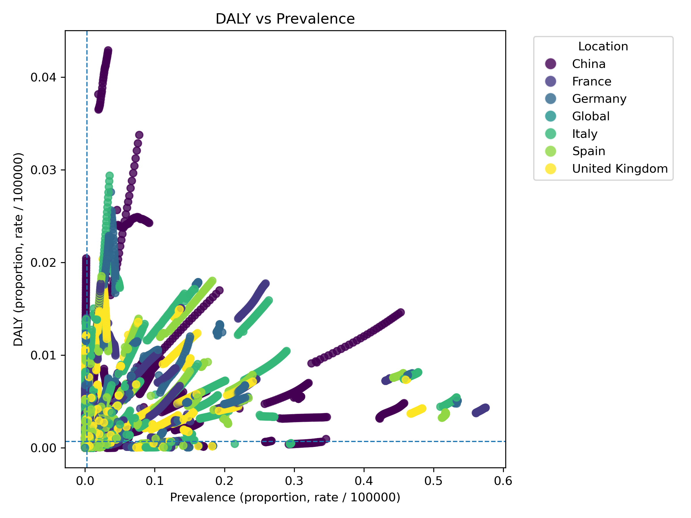

# DALY vs Prevalence Analysis Report

**Date:** 2025-11-28 12:22:50

**Total Conditions:** 163

**Locations:** China, France, Germany, Italy, Spain, United Kingdom, Global

**Years:** 2022-2050

**Filter:** Median-filtered diseases (Combined Score)

## Median Analysis Plot

- **X-Axis Intersect (Prevalence):** 0.0027
- **Y-Axis Intersect (DALY):** 0.0007

## High Impact Diseases (High DALY & High Prevalence)

Diseases falling into the top-right quadrant (above both threshold filters).

| Condition | Data Points in High/High Quadrant |
|---|---|
| Age-related and other hearing loss | 174 |
| Alcohol use disorders | 174 |
| Alzheimer's disease and other dementias | 174 |
| Anxiety disorders | 174 |
| Autism spectrum disorders | 174 |
| Atrial fibrillation and flutter | 174 |
| Breast cancer | 174 |
| Blindness and vision loss | 174 |
| Osteoarthritis | 174 |
| Other mental disorders | 174 |
| Chronic kidney disease | 174 |
| Diabetes mellitus | 174 |
| Depressive disorders | 174 |
| Congenital birth defects | 174 |
| Cirrhosis and other chronic liver diseases | 174 |
| Chronic obstructive pulmonary disease | 174 |
| Dermatitis | 174 |
| Gallbladder and biliary diseases | 174 |
| Headache disorders | 174 |
| Gynecological diseases | 174 |
| Exposure to mechanical forces | 174 |
| Falls | 174 |
| Endocrine, metabolic, blood, and immune disorders | 174 |
| Drug use disorders | 174 |
| Neck pain | 174 |
| Neonatal disorders | 174 |
| Other musculoskeletal disorders | 174 |
| Oral disorders | 174 |
| Parkinson's disease | 174 |
| Road injuries | 174 |
| Upper digestive system diseases | 174 |
| Stroke | 174 |
| Ischemic heart disease | 174 |
| Low back pain | 174 |
| Colon and rectum cancer | 173 |
| Asthma | 172 |
| Urinary diseases and male infertility | 171 |
| Other sense organ diseases | 170 |
| Idiopathic epilepsy | 157 |
| Psoriasis | 145 |
| Non-rheumatic valvular heart disease | 145 |
| Schizophrenia | 145 |
| Prostate cancer | 145 |
| Other cardiovascular and circulatory diseases | 145 |
| Bipolar disorder | 145 |
| Hypertensive heart disease | 130 |
| Acne vulgaris | 127 |
| Other neoplasms | 116 |
| Eating disorders | 110 |
| Peripheral artery disease | 109 |
| Diarrheal diseases | 105 |
| Rheumatoid arthritis | 99 |
| Viral skin diseases | 87 |
| Bacterial skin diseases | 60 |
| Foreign body | 58 |
| Other skin and subcutaneous diseases | 44 |
| Bladder cancer | 43 |
| Other unintentional injuries | 42 |
| Fungal skin diseases | 41 |
| COVID-19 | 32 |
| Cardiomyopathy and myocarditis | 29 |
| Interpersonal violence | 29 |
| Dietary iron deficiency | 29 |
| HIV/AIDS | 29 |
| Rheumatic heart disease | 29 |
| Scabies | 29 |
| Inflammatory bowel disease | 29 |
| Protein-energy malnutrition | 29 |
| Uterine cancer | 15 |
| Hemoglobinopathies and hemolytic anemias | 11 |
| Fire, heat, and hot substances | 1 |
| Tuberculosis | 1 |

## Conclusions

The plot above visualizes the relationship between disease prevalence and DALYs. Diseases in the top-right quadrant represent the highest burden and highest prevalence, indicating priority areas for intervention.
